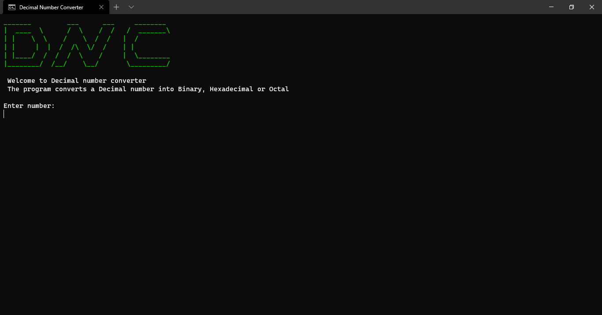
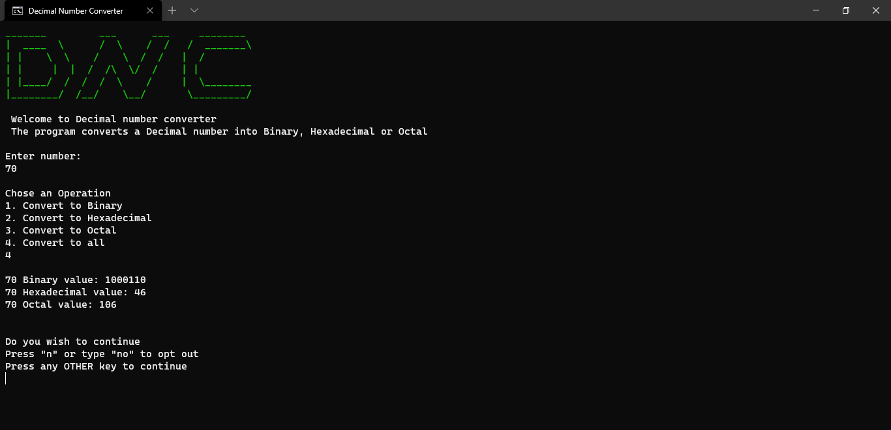
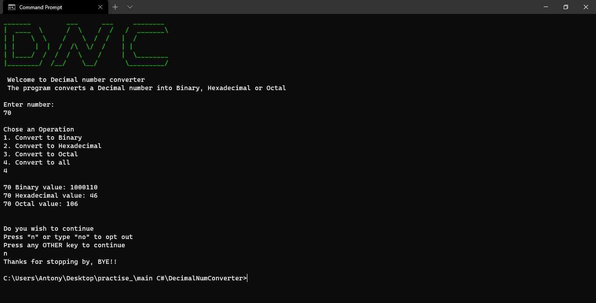

# DECIMAL NUMBER CONVERTER 🧮

## Description
Decimal Number Converter(DNC), just as it sounds is a C# calculator that converts a decimal number to **Binary**, **Octal** and **Hexadecimal**.

The project was built as part of a class assignment for **Computer Programming II** class.

## Features
1. Decimal number conversion to _**Binary**_
1. Decimal number conversion to _**Octal**_
1. Decimal number conversion to _**Hexadecimal**_

# Installation
The installation is in 2 easy steps

## Requirements
* [.NET Framework](https://dotnet.microsoft.com/download/dotnet-framework)

## Installation Process
1. Clone the repository by: `git clone https://github.com/JacobJax/Decimal-Number-Converter.git` or click on the dropdown and download project as zipped file.
1. Run `dotnet run`

# Usage
Using the program easy and is accomplished in just two steps.

When you run `dotnet run` the program prompts you for a number.

Enter the number(**_in DECIMAL_**) you wish to convert and press _Enter_.

Chose an option, by typing a number **between 1 and 4** then press _Enter_ to see result.

>**NOTE:**
> If you enter a value less that 1 the value of your entry will be set to 1.

As stated in the program instructions, you can press letter **_N_** or type **_NO_** then press _Enter_ to end the program.

If you want to go again press **any othey key** then _Enter_ to go again.
